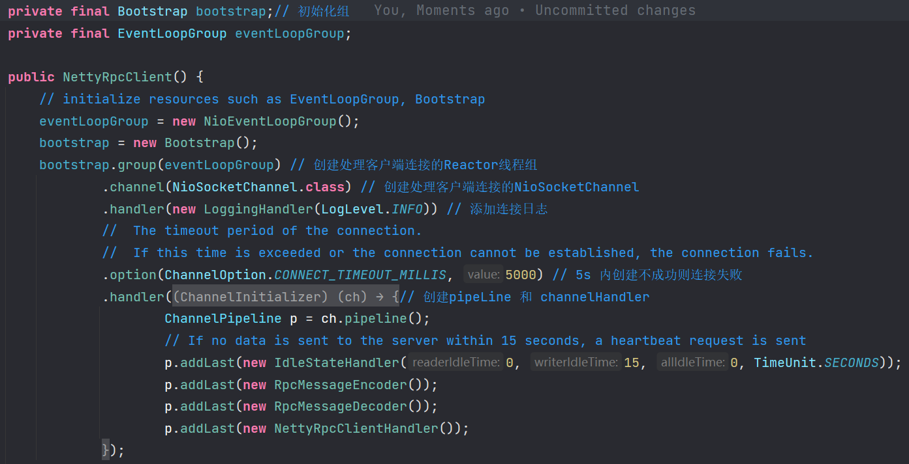
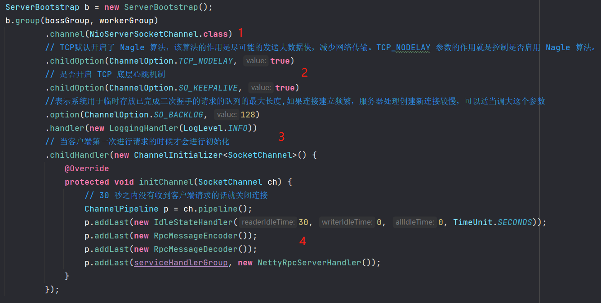
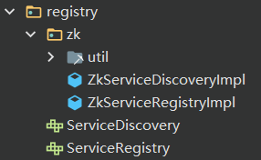
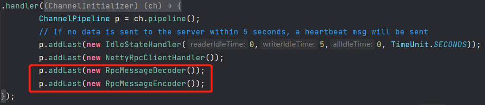
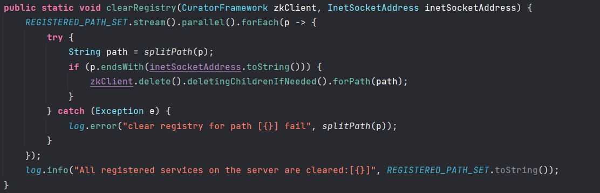
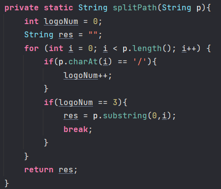

# KK-RPC-FrameWork


## 版块一 （服务器搭建 网络传输）

服务器有两种基本方案

1. 使用Socket搭建原始网络传输的客户端服务端，传统的BIO形式，阻塞IO，性能差功能单一。
2. 使用Netty搭建作为网络传输，非阻塞的NIO形式，简化了TCP/UDP等网络编程，使用方便。


Socket不解释原理。

解释一下Netty的原理。

可以看博客：[彻底理解Netty，这一篇文章就够了](https://juejin.cn/post/6844903703183360008)

本项目如何搭建Netty服务器：


NettyRpcClient 为主体，Handler为处理服务器返回消息并且配置心跳机制

ChannelProvider用来做一个频道的复用，存储于一个map结构中。

```java
@Slf4j
public class ChannelProvider {

    private final Map<String, Channel> channelMap;

    public ChannelProvider() {
        channelMap = new ConcurrentHashMap<>();
    }

    public Channel get(InetSocketAddress inetSocketAddress) {
        // 把ip地址转换成字符串从map中取，取到的话就判断频道是否还在连接中，无法使用就从map中删除。
    }

    public void set(InetSocketAddress inetSocketAddress, Channel channel) {
        // 新建的频道放入map中
    }

    public void remove(InetSocketAddress inetSocketAddress) {
        // 把此频道从map中删除
    }
}
```


### NettyClient 客户端 初始化创建过程：

Reactor 线程组用来建立连接Socket，读写网络数据，处理业务功能。

Netty 的 EventGroup 自动封装好了多线程Reactor模型

==Reactor 主从模型==：




**接下来就是doconnect，getchannel，sendRequest**

```java
    @SneakyThrows
    public Channel doConnect(InetSocketAddress inetSocketAddress) {
        // 建立连接 返回频道
    }

    public Channel getChannel(InetSocketAddress inetSocketAddress) {
        // 从map中取得Channel，否则新建 doConnect(inetSocketAddress);
    }
	// 发送请求
    public Object sendRpcRequest(RpcRequest rpcRequest) {
        // build return value
        CompletableFuture<RpcResponse<Object>> resultFuture = new CompletableFuture<>();
        // get server address 从注册中心获取ip地址
        InetSocketAddress inetSocketAddress = serviceDiscovery.lookupService(rpcRequest);
        // get  server address related channel
        Channel channel = getChannel(inetSocketAddress);
        if (channel.isActive()) {
            // put unprocessed request
            unprocessedRequests.put(rpcRequest.getRequestId(), resultFuture);
            RpcMessage rpcMessage = RpcMessage.builder().data(rpcRequest)
                    .codec(SerializationTypeEnum.KYRO.getCode())
                    .compress(CompressTypeEnum.GZIP.getCode())
                    .messageType(RpcConstants.REQUEST_TYPE).build();
            // 向频道中发送消息
            channel.writeAndFlush(rpcMessage).addListener((ChannelFutureListener) future -> {
                if (future.isSuccess()) {
                    log.info("client send message: [{}]", rpcMessage);
                } else {
                    future.channel().close();
                    resultFuture.completeExceptionally(future.cause());
                    log.error("Send failed:", future.cause());
                }
            });
        } else {
            throw new IllegalStateException();
        }

        return resultFuture;
    }

```


### NettyClient 服务端 初始化创建过程：



实现了一个线程工厂组任务来为Reactor模型提供线程。

```java
DefaultEventExecutorGroup serviceHandlerGroup = new DefaultEventExecutorGroup(
        RuntimeUtil.cpus() * 2,
        ThreadPoolFactoryUtil.createThreadFactory("service-handler-group", false)
);
```


## 版块二 （Zookeeper 注册中心）

**包类如下**：

****

主要功能为服务发现和服务注册，使用Curator来搭建连接zookeeper。

#### 客户端连接zookeeper：

```java
public final class CuratorUtils {

    private static final int BASE_SLEEP_TIME = 1000;
    private static final int MAX_RETRIES = 3;
    public static final String ZK_REGISTER_ROOT_PATH = "/my-rpc";// 根目录
    // 存储服务地址
    private static final Map<String, List<String>> SERVICE_ADDRESS_MAP = new ConcurrentHashMap<>();
    private static final Set<String> REGISTERED_PATH_SET = ConcurrentHashMap.newKeySet();
    private static CuratorFramework zkClient;
    private static final String DEFAULT_ZOOKEEPER_ADDRESS = "127.0.0.1:2181";

    public static void createPersistentNode(CuratorFramework zkClient, String path) {
    /**
     *	创建永久节点 先检查是否存在，存在则复用返回，不存在则创建
     */
    }


    public static List<String> getChildrenNodes(CuratorFramework zkClient, String rpcServiceName) {
    /**
     * 获取子节点列表
     * @param rpcServiceName rpc service name eg:github.javaguide.HelloServicetest2version1
     * @return All child nodes under the specified node
     */
    }


    public static void clearRegistry(CuratorFramework zkClient, InetSocketAddress inetSocketAddress) {
    /**
     * Empty the registry of data
     * 删除所有节点
     */
    }

    public static CuratorFramework getZkClient() {
        // check if user has set zk address

        // if zkClient has been started, return directly

        // Retry strategy. Retry 3 times, and will increase the sleep time between retries.

                // the server to connect to (can be a server list)

        zkClient.start();
        try {
            // wait 30s until connect to the zookeeper
            if (!zkClient.blockUntilConnected(30, TimeUnit.SECONDS)) {
                throw new RuntimeException("Time out waiting to connect to ZK!");
            }
        } catch (InterruptedException e) {
            e.printStackTrace();
        }
        return zkClient;
    }


    private static void registerWatcher(String rpcServiceName, CuratorFramework zkClient) throws Exception {
    /**
     * 注册监听通知子节点
     *
     * @param rpcServiceName rpc service name eg:github.javaguide.HelloServicetest2version
     */

}
```

#### 服务注册中心：

```java
public class ZkServiceRegistryImpl implements ServiceRegistry {

    @Override
    public void registerService(String rpcServiceName, InetSocketAddress inetSocketAddress) {
        String servicePath = CuratorUtils.ZK_REGISTER_ROOT_PATH + "/" + rpcServiceName + inetSocketAddress.toString();
        CuratorFramework zkClient = CuratorUtils.getZkClient();
        // 创建永久节点
        CuratorUtils.createPersistentNode(zkClient, servicePath);
    }
}
```

#### **给服务端用于注册服务的类**

```java
public class ZkServiceProviderImpl implements ServiceProvider {

    /**
     * key: rpc service name(interface name + version + group)
     * value: service object
     */
    private final Map<String, Object> serviceMap;
    private final Set<String> registeredService;
    private final ServiceRegistry serviceRegistry;

    // 得到连接zookeeper的客户端
    public ZkServiceProviderImpl() {
        serviceMap = new ConcurrentHashMap<>();
        registeredService = ConcurrentHashMap.newKeySet();
        serviceRegistry = ExtensionLoader.getExtensionLoader(ServiceRegistry.class).getExtension("zk");
    }

    @Override
    public void addService(RpcServiceConfig rpcServiceConfig) {
        /*
        * 把服务放入map中
        */
    }

    @Override
    public Object getService(String rpcServiceName) {
        // 从map中获取服务
    }

    // 注册上传服务 注册到zookeeper中
    @Override
    public void publishService(RpcServiceConfig rpcServiceConfig) {
        try {
            String host = InetAddress.getLocalHost().getHostAddress();
            this.addService(rpcServiceConfig);
            serviceRegistry.registerService(rpcServiceConfig.getRpcServiceName(), new InetSocketAddress(host, NettyRpcServer.PORT));
        } catch (UnknownHostException e) {
            log.error("occur exception when getHostAddress", e);
        }
    }

}
```

#### 服务发现类：

```java
public class ZkServiceDiscoveryImpl implements ServiceDiscovery {
 
    private final LoadBalance loadBalance;

    public ZkServiceDiscoveryImpl() {
           // 获取负载均衡的算法
        this.loadBalance = ExtensionLoader.getExtensionLoader(LoadBalance.class).getExtension("loadBalance");
    }

    @Override
    public InetSocketAddress lookupService(RpcRequest rpcRequest) {
        String rpcServiceName = rpcRequest.getRpcServiceName();
        CuratorFramework zkClient = CuratorUtils.getZkClient();
        List<String> serviceUrlList = CuratorUtils.getChildrenNodes(zkClient, rpcServiceName);
        if (CollectionUtil.isEmpty(serviceUrlList)) {
            throw new RpcException(RpcErrorMessageEnum.SERVICE_CAN_NOT_BE_FOUND, rpcServiceName);
        }
        // load balancing
        String targetServiceUrl = loadBalance.selectServiceAddress(serviceUrlList, rpcRequest);
        log.info("Successfully found the service address:[{}]", targetServiceUrl);
        String[] socketAddressArray = targetServiceUrl.split(":");
        String host = socketAddressArray[0];
        int port = Integer.parseInt(socketAddressArray[1]);
        return new InetSocketAddress(host, port);
    }
}
```


## 版块三 （序列化协议）

#### 序列化接口

```java
public interface Serializer {
    /**
     * 序列化
     *
     * @param obj 要序列化的对象
     * @return 字节数组
     */
    byte[] serialize(Object obj);

    /**
     * 反序列化
     *
     * @param bytes 序列化后的字节数组
     * @param clazz 目标类
     * @param <T>   类的类型。举个例子,  {@code String.class} 的类型是 {@code Class<String>}.
     *              如果不知道类的类型的话，使用 {@code Class<?>}
     * @return 反序列化的对象
     */
    <T> T deserialize(byte[] bytes, Class<T> clazz);
}
```

#### kryo方式实现序列化：

```java
public class KryoSerializer implements Serializer {

    /**
   	 * 线程不安全，所以需要使用ThreadLocal来储存传输实体。
     * Because Kryo is not thread safe. So, use ThreadLocal to store Kryo objects
     */
    private final ThreadLocal<Kryo> kryoThreadLocal = ThreadLocal.withInitial(() -> {
        Kryo kryo = new Kryo();
        kryo.register(RpcResponse.class);
        kryo.register(RpcRequest.class);
        return kryo;
    });

    @Override
    public byte[] serialize(Object obj) {
        try (ByteArrayOutputStream byteArrayOutputStream = new ByteArrayOutputStream();
             Output output = new Output(byteArrayOutputStream)) {
            Kryo kryo = kryoThreadLocal.get();
            // Object->byte:将对象序列化为byte数组
            kryo.writeObject(output, obj);
            kryoThreadLocal.remove();
            return output.toBytes();
        } catch (Exception e) {
            throw new SerializeException("Serialization failed");
        }
    }

    @Override
    public <T> T deserialize(byte[] bytes, Class<T> clazz) {
        try (ByteArrayInputStream byteArrayInputStream = new ByteArrayInputStream(bytes);
             Input input = new Input(byteArrayInputStream)) {
            Kryo kryo = kryoThreadLocal.get();
            // byte->Object:从byte数组中反序列化出对对象
            Object o = kryo.readObject(input, clazz);
            kryoThreadLocal.remove();
            return clazz.cast(o);
        } catch (Exception e) {
            throw new SerializeException("Deserialization failed");
        }
    }

}
```

#### 编解码集成Netty服务器：

**设计传输协议**

RpcMessage的头部，后面是data


4B  magic code（魔法数）   1B version（版本）   4B full length（消息长度）    1B messageType（消息类型）

1B compress（压缩类型） 1B codec（序列化类型）    4B  requestId（请求的Id）


**编解码实现**

先实现上图所说的一些成员：

```java
public class RpcConstants {
    /**
     * Magic number. Verify RpcMessage
     */
    public static final byte[] MAGIC_NUMBER = {(byte) 'g', (byte) 'r', (byte) 'p', (byte) 'c'};
    public static final Charset DEFAULT_CHARSET = StandardCharsets.UTF_8;
    //version information
    public static final byte VERSION = 1;
    public static final byte TOTAL_LENGTH = 16;
    public static final byte REQUEST_TYPE = 1;
    public static final byte RESPONSE_TYPE = 2;
    //ping
    public static final byte HEARTBEAT_REQUEST_TYPE = 3;
    //pong
    public static final byte HEARTBEAT_RESPONSE_TYPE = 4;
    public static final int HEAD_LENGTH = 16;
    public static final String PING = "ping";
    public static final String PONG = "pong";
    public static final int MAX_FRAME_LENGTH = 8 * 1024 * 1024;

}
```

**RpcMessageEncoder 编码器**

```java
public class RpcMessageEncoder extends MessageToByteEncoder<RpcMessage> {
    // 发出请求数量的更替，使用原子性的Integer
    private static final AtomicInteger ATOMIC_INTEGER = new AtomicInteger(0);

    @Override
    protected void encode(ChannelHandlerContext ctx, RpcMessage rpcMessage, ByteBuf out) {
        try {
            out.writeBytes(RpcConstants.MAGIC_NUMBER); // 4B "grpc"
            out.writeByte(RpcConstants.VERSION); // 1B
            // leave a place to write the value of full length
            out.writerIndex(out.writerIndex() + 4);
            byte messageType = rpcMessage.getMessageType();
            out.writeByte(messageType); // 1B
            out.writeByte(rpcMessage.getCodec()); // 0x01 ---> 1B  "kryo"
            out.writeByte(CompressTypeEnum.GZIP.getCode()); // 0x01 ---> 1B "gzip"
            out.writeInt(ATOMIC_INTEGER.getAndIncrement()); // requestId 自增 Integer ---> 4B
            // build full length
            byte[] bodyBytes = null;
            int fullLength = RpcConstants.HEAD_LENGTH; // 头部长度为16B
            // if messageType is not heartbeat message,fullLength = head length + body length 排除心跳机制发送的报文
            if (messageType != RpcConstants.HEARTBEAT_REQUEST_TYPE
                    && messageType != RpcConstants.HEARTBEAT_RESPONSE_TYPE) {
                // serialize the object
                String codecName = SerializationTypeEnum.getName(rpcMessage.getCodec());
                log.info("codec name: [{}] ", codecName);
                Serializer serializer = ExtensionLoader.getExtensionLoader(Serializer.class)
                        .getExtension(codecName);
                bodyBytes = serializer.serialize(rpcMessage.getData());
                // compress the bytes
                String compressName = CompressTypeEnum.getName(rpcMessage.getCompress());
                Compress compress = ExtensionLoader.getExtensionLoader(Compress.class)
                        .getExtension(compressName);
                bodyBytes = compress.compress(bodyBytes);
                fullLength += bodyBytes.length;
            }

            if (bodyBytes != null) {
                out.writeBytes(bodyBytes);
            }
            int writeIndex = out.writerIndex(); // 先保存当前指针位置，存好之前预留的空间之后再返回当前位置
            out.writerIndex(writeIndex - fullLength + RpcConstants.MAGIC_NUMBER.length + 1); // 加 1 是跳过版本号，到之前预留的缓冲区
            out.writeInt(fullLength);
            out.writerIndex(writeIndex); // 恢复指针位置
        } catch (Exception e) {
            log.error("Encode request error!", e);
        }

    }
```

**RpcMessageDecoder 解码器**

```java
public class RpcMessageDecoder extends LengthFieldBasedFrameDecoder {
    public RpcMessageDecoder() {
        // lengthFieldOffset: magic code is 4B, and version is 1B, and then full length. so value is 5
        // lengthFieldLength: full length is 4B. so value is 4
        // lengthAdjustment: full length include all data and read 9 bytes before, so the left length is (fullLength-9). so values is -9
        // initialBytesToStrip: we will check magic code and version manually, so do not strip any bytes. so values is 0
        this(RpcConstants.MAX_FRAME_LENGTH, 5, 4, -9, 0);
    }
    
    public RpcMessageDecoder(int maxFrameLength, int lengthFieldOffset, int lengthFieldLength,
                             int lengthAdjustment, int initialBytesToStrip) {
        super(maxFrameLength, lengthFieldOffset, lengthFieldLength, lengthAdjustment, initialBytesToStrip);
    }

    @Override
    protected Object decode(ChannelHandlerContext ctx, ByteBuf in) throws Exception {
        // 得到 bytebuf，转到 decodeFrame() 调用解析 bytebuf
        return decoded;
    }


    private Object decodeFrame(ByteBuf in) {
        // note: must read ByteBuf in order
        checkMagicNumber(in);
        checkVersion(in);
        // magicNumber and version has been read so begin with full length.
        int fullLength = in.readInt();
        // build RpcMessage object
        byte messageType = in.readByte();
        byte codecType = in.readByte();
        byte compressType = in.readByte();
        int requestId = in.readInt();
        RpcMessage rpcMessage = RpcMessage.builder()
                .codec(codecType)
                .requestId(requestId)
                .messageType(messageType).build();
        if (messageType == RpcConstants.HEARTBEAT_REQUEST_TYPE) {
            rpcMessage.setData(RpcConstants.PING);
            return rpcMessage;
        }
        if (messageType == RpcConstants.HEARTBEAT_RESPONSE_TYPE) {
            rpcMessage.setData(RpcConstants.PONG);
            return rpcMessage;
        }
        int bodyLength = fullLength - RpcConstants.HEAD_LENGTH;
        if (bodyLength > 0) {
            byte[] bs = new byte[bodyLength];
            in.readBytes(bs);
            // decompress the bytes
            String compressName = CompressTypeEnum.getName(compressType);
            Compress compress = ExtensionLoader.getExtensionLoader(Compress.class)
                    .getExtension(compressName);
            bs = compress.decompress(bs);
            // deserialize the object
            String codecName = SerializationTypeEnum.getName(rpcMessage.getCodec());
            log.info("codec name: [{}] ", codecName);
            Serializer serializer = ExtensionLoader.getExtensionLoader(Serializer.class)
                    .getExtension(codecName);
            if (messageType == RpcConstants.REQUEST_TYPE) {
                RpcRequest tmpValue = serializer.deserialize(bs, RpcRequest.class);
                rpcMessage.setData(tmpValue);
            } else {
                RpcResponse tmpValue = serializer.deserialize(bs, RpcResponse.class);
                rpcMessage.setData(tmpValue);
            }
        }
        return rpcMessage;

    }

    private void checkVersion(ByteBuf in) {
        // read the version and compare
        byte version = in.readByte();
        if (version != RpcConstants.VERSION) {
            throw new RuntimeException("version isn't compatible" + version);
        }
    }

    private void checkMagicNumber(ByteBuf in) {
        // read the first 4 bit, which is the magic number, and compare
        int len = RpcConstants.MAGIC_NUMBER.length;
        byte[] tmp = new byte[len];
        in.readBytes(tmp);
        for (int i = 0; i < len; i++) {
            if (tmp[i] != RpcConstants.MAGIC_NUMBER[i]) {
                throw new IllegalArgumentException("Unknown magic code: " + Arrays.toString(tmp));
            }
        }
    }

}
```


## Debug 日记

#### 一、管道中数据传输未编解码就已被处理

​	Client 端发送 request ，server 能够正常接收并且能够成功的解压和解码，但是发送回Client的时候，Client端接受不到数据，debug了一下返回的并不是预期的数据，而是 PooledUnsafeDirectByteBuf(ridx: 0, widx: 166, cap: 2048)，然后上网查找这是什么东西，发现有关的是client和server的编解码不统一，不对啊，我两者使用的都是一样的编解码器，然后从编解码器入手查看，发现在client端



这一块地方，由于顺序出错，这样子在管道中addlast，就会导致data先会被ClientHandler接收并处理，这样处理到的数据就是没有被解码的数据，自然无法识别，所以需要把编解码器在Handler前addlast，这样就可以顺利解码了。管道就类似一个流水线，数据在这个流水线上传输并被处理。

#### 二、留存在Zookeeper的注册数据无法被清除，导致下一次连接被分配到无效的ip （ip多变环境下）

​	首先在服务端关闭的时候，最后会有一个线程执行一项清理zookeeper中注册的服务，即shutdownhook，但由于笔记本连接wifi原因，每天的IP地址都不一定一样，就导致在获取本地ip地址时，可能昨天使用的ip地址注册的服务并不能够清除，问题锁定在清除服务的时候，清楚服务失败导致zookeeper中服务所占有的ip列表有很多种（IP地址和端口号的排列组合）没被成功删除，那么如果下一天的ip地址变换的话例如 从 192.168.0.105 ----> 192.168.0.107 就会又新增多个ip地址进入zookeeper中（因为服务名是一样的）,（当然在单机的情况下）这样在负载均衡的时候，优先选择到的ip地址可能是无效的，还是得到具体的生产环境中，可能就不会出现这种问题。

解决方案：



在得到需要删除的服务的IP地址的时候，截取路径名到ip地址前的服务名为止，删除这个节点及其的子节点。

**问题即可解决！！！**
